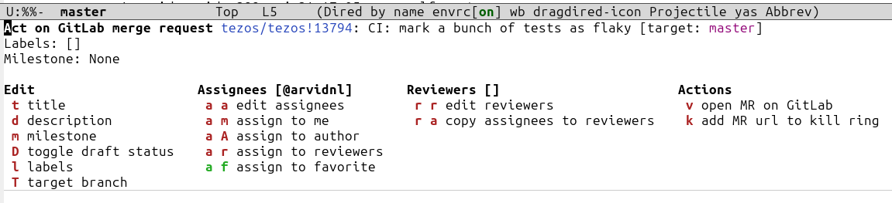

# Magit GitLab

[Magit](https://github.com/magit/magit) plugin for manipulating GitLab
merge requests.



## Installation

You can download and setup `magit-gitlab` from
[MELPA](https://melpa.org/#/magit-gitlab) using
[use-package](https://github.com/jwiegley/use-package) with the
following snippet, to be placed in your Emacs init-file:

```lisp
(use-package magit-gitlab
  :ensure t
  :config
  ;; Update magit-mode-map such that pressing @ opens the magit-gitlab-mr transient
  (define-key magit-mode-map (kbd "@") 'magit-gitlab-mr)
  (transient-append-suffix 'magit-dispatch "!" '("@" "Act on MR" magit-gitlab-mr)))
```

You can also just install it with `M-x package-install RET magit-gitlab`.

## Setup

Magit GitLab requires a [GitLab personal access
token](https://gitlab.com/-/user_settings/personal_access_tokens) to
interact with the GitLab API. I have not experimented with scopes, but
you probably need to have the largest scope, `api`, for the token. 

Then, to configure `magit-gitlab`:

1. run `git config --global gitlab.user USERNAME` to specify your
   GitLab username.
2. add `machine gitlab.com/api/v4 login USERNAME^magit-gitlab password
   glpat-TOKEN`, to the file `~/.authinfo`, or some other file listed
   in the Emacs variable `authinfo-sources`.

Where `USERNAME` is replaced by your GitLab username, and
`glpat-TOKEN` is replaced by your GitLab personal access token.

## Usage

Call `M-x magit-gitlab-mr` when visiting a `magit-status` buffer for a
branch connected to a GitLab merge request. A transient should open
allowing you to act on the merge request.
